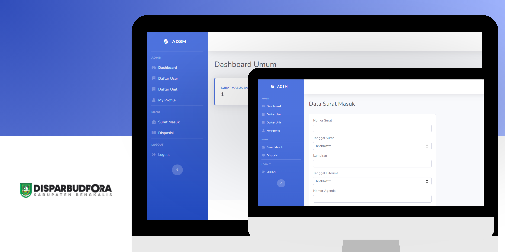

<div align="center">


##

### Aplikasi Disposisi Surat Masuk, Dinas Pariwisata, Kebudayaan, Kepemudaan dan Olahraga Kabupaten Bengkalis

</div>

## 📙 Description

Aplikasi Disposisi Surat Masuk for the Bengkalis Regency Tourism, Culture, Youth and Sports Office is a system designed to facilitate the management of entry letters in this service. This application has two main actors, namely the General Section and Field Operators. The General Section is responsible for sending incoming letters and disposing of these letters to the Head of Department and the fields within the Department of Tourism, Culture, Youth and Sports (DISPARBUDPORA).

In addition, Field Operators also have the ability to archive incoming letters that have been processed. This disposition feature ensures that incoming mail can be followed up quickly by the authorized parties. The General Section also has the right to add units and users who can log into the application, making it easier to manage access and membership in the system.

With this application, the management of incoming letters becomes more structured and efficient, supporting smooth administration within the Bengkalis Regency Tourism, Culture, Youth and Sports Office.



## 📖 Features

Interesting features of Aplikasi Disposisi Surat Masuk:

1. **Authentication**: This feature allows registered users, such as admins and field operators, to log into the application using a registered account.

2. **CRUD Incoming Letter Data**: This feature allows the General Department to add, view, change, search and delete data on incoming letters received by the Department. Users can manage incoming letters efficiently, including grouping letters.

3. **Disposition of Incoming Letters**: After the letter is received, the General Department can dispose of the letter to the Head of Service and related fields in DISPARBUDPORA, ensuring that the letter is followed up appropriately. This disposition ensures that every incoming letter can be processed in a clear and timely manner.

4. **Incoming Mail Tracking**: This feature allows the General Department to track the status of incoming mail that has been disposed of. Users can see the progress of the letter's disposition, who has followed up on the letter, as well as the status and last date the letter was processed. This tracking feature helps ensure that no mail is missed and ensures that mail is processed according to the established flow.

5. **Archive of Incoming Letters**: After disposition, letters can be archived for future documentation and reference purposes. The General Department can manage incoming mail archives neatly and easily accessed.

6. **Unit and User Management**: The General section has access rights to add new units and users who can log into the system. This feature makes it easier for administration to manage membership and access rights in the application, so that only authorized users can access certain features.

## 🛠️ Project Installation Guide

Following are the steps to install a CodeIgniter project:

### Prerequisites

Make sure you have [PHP](https://www.php.net/) installed on your system before starting the installation.

### Steps

**1.** Clone your CodeIgniter project repository into a local directory:

```bash
git clone https://github.com/ramadhanabelio/adsm-disparbudpora.git
```

**2.** Go to the project directory:

```bash
cd adsm-disparbudpora
```

**3.** Configure base_url in application/config/config.php:

Open the config.php file located at application/config/config.php.
Look for the following line:

```bash
$config['base_url'] = 'http://localhost/adsm-disparbudpora/';
```

Modify the URL to match the directory or folder name of your project. For example, if the project is in a folder called adsm-disparbudpora, keep it as is. If the folder name is different, change it accordingly:

```bash
$config['base_url'] = 'http://localhost/project-name/';
```

**4.** Configure the database in application/config/database.php:

First, create a database named adsm_diparbudpora in your MySQL database.

```bash
CREATE DATABASE adsm_disparbudpora;
```

Import the SQL file in the database folder with the name adsm_disparbudpora.sql

Open the database.php file located at application/config/database.php.
Update the database connection settings to match your local database configuration:

```bash
'hostname' => 'localhost',
'username' => 'root',
'password' => '',
'database' => 'adsm_disparbudpora',
```

**5.** Create a folder for file uploads:

1. Open your command prompt (CMD) or terminal.
2. Navigate to the assets folder in your project directory.
3. Create a folder named file and then create a subfolder called suratmasuk within it to store incoming letter files:

```bash
cd assets
mkdir file
cd file
mkdir suratmasuk
```

**6.** Create a folder for signature images:

Similarly, create a folder named signature-image in the assets directory to store signature images:

```bash
cd ../
mkdir signature-image
```

**7.** Access your project:

Once the configuration is complete, you can access your project via the browser. Open your browser and go to the URL specified in the base_url setting.

For example, if you set the base_url as http://localhost/adsm-disparbudpora/, you can access the application by visiting:

```bash
http://localhost/adsm-disparbudpora/
```

After following the steps above, your CodeIgniter project is now ready to use and can be accessed via the browser at http://localhost/adsm-disparbudpora.
